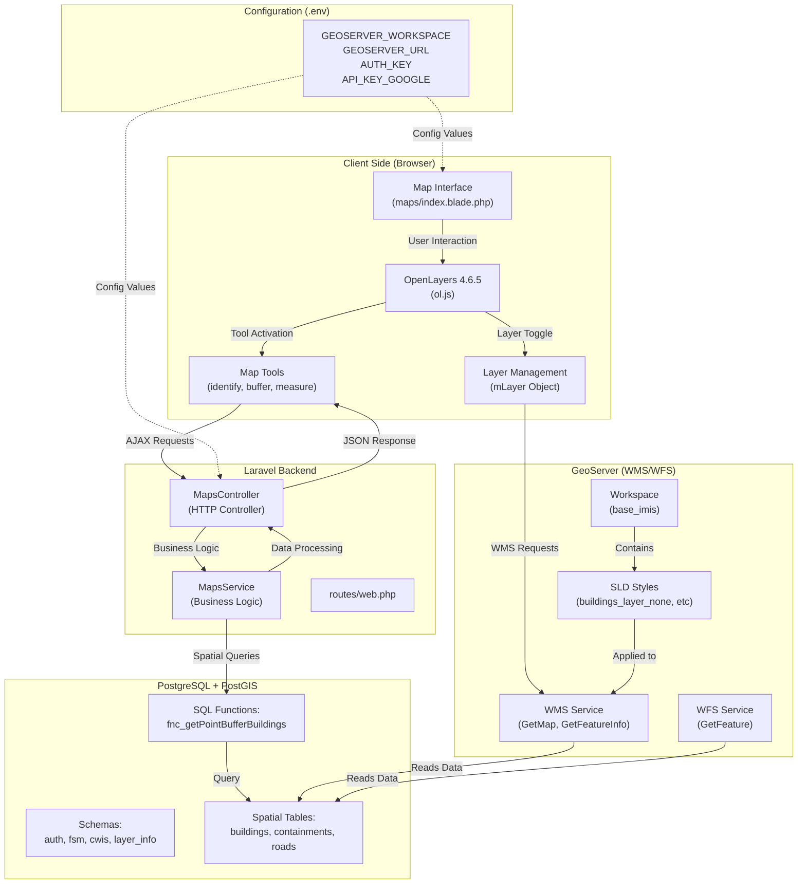

## 🗺️ Map Feature Architecture - Complete Guide
> Comprehensive explanation with a Mermaid diagram showing how the map feature works in this Laravel IMIS application.



### **1. GeoServer Connection & Layer Display**

#### **Configuration** (constants.php)
```php
'GEOSERVER_WORKSPACE' => env('GEOSERVER_WORKSPACE'),  // e.g., 'base_imis'
'GEOSERVER_URL' => env('GEOSERVER_URL'),              // e.g., 'http://server:8080/geoserver/workspace/'
'AUTH_KEY' => env('AUTH_KEY'),                        // GeoServer auth
```

#### **Layer Initialization** (index.blade.php)
```javascript
var workspace = '<?php echo Config::get("constants.GEOSERVER_WORKSPACE"); ?>';
var gurl = "<?php echo Config::get("constants.GEOSERVER_URL"); ?>/";
var gurl_wms = gurl + 'wms';  // WMS endpoint
var gurl_wfs = gurl + 'wfs';  // WFS endpoint
var gurl_legend = gurl_wms + "?REQUEST=GetLegendGraphic&VERSION=1.0.0&FORMAT=image/png...";
```

#### **Layer Object Structure** (index.blade.php)
```javascript
var mLayer = {
    buildings_layer: {
        name: 'Building',
        styles: {
            buildings_layer_none: { name: 'None' },
            buildings_layer_structure_type: { name: 'Structure Type' },
            // ... more styles
        },
        layer: ol.layer.Image,  // OpenLayers layer object
        filters: []
    },
    containments_layer: { /* ... */ },
    roads_layer: { /* ... */ }
    // ... permission-based layers via @can('Permission Name')
};
```

#### **WMS Layer Creation** (index.blade.php)
```javascript
var layer = new ol.layer.Image({
    visible: false,
    source: new ol.source.ImageWMS({
        url: gurl_wms,
        params: {
            'LAYERS': workspace + ':' + key,  // e.g., 'base_imis:buildings_layer'
            'TILED': true,
            'CQL_FILTER': 'deleted_at is NULL',
        },
        serverType: 'geoserver'
    })
});
```

---

### **2. Map Tools - How They Work**

#### **Tool Pattern Architecture**
Each tool follows this pattern:

1. **Button Click** → Activates tool
2. **Event Listener** → Attached to map (click, hover, draw)
3. **Spatial Operation** → Query GeoServer/Database
4. **Result Display** → Popup or modal

#### **Example: Info Tool** (index.blade.php)
```javascript
$('#identify_control').click(function (e) {
    e.preventDefault();
    disableAllControls();  // Disable other tools

    if (currentControl == 'identify_control') {
        currentControl = '';
    } else {
        currentControl = 'identify_control';
        $('#identify_control').addClass('map-control-active');
        map.on('singleclick', displayFeatureInformation);  // Attach event
    }
});
```

**displayFeatureInformation()** (index.blade.php)
```javascript
function displayFeatureInformation(evt) {
    var selectedLayer = $('#feature_info_overlay').val();
    var coordinate = evt.coordinate;

    // Create WMS GetFeatureInfo request
    var source = new ol.source.ImageWMS({
        url: gurl_wms,
        params: {
            'LAYERS': workspace + ':' + selectedLayer,
            'PROPERTYNAME': 'bin,house_number,road_code,...'  // Fields to fetch
        }
    });

    var url = source.getFeatureInfoUrl(
        coordinate, resolution, 'EPSG:3857',
        { 'INFO_FORMAT': 'application/json' }
    );

    $.ajax({
        url: url,
        success: function(data) {
            // Display feature attributes in popup
            $('#feature_information').html(formattedHTML);
        }
    });
}
```

#### **Example: Point Buffer Tool** (index.blade.php)
```javascript
$('#pointbuffer_control').click(function (e) {
    currentControl = 'pointbuffer_control';
    map.on('singleclick', displayPopupPointBuffer);
});
```

**Backend Processing** (MapsController.php)
```php
public function getPointBufferBuildings(Request $request)
{
    $distance = $request->distance;
    $long = $request->long;
    $lat = $request->lat;

    $results = $this->mapsService->getPointBufferBuildingsSummary($distance, $long, $lat);

    return response()->json($results);
}
```

**Service Layer** (MapsService.php)
```php
public function getPointBufferBuildingsSummary($distance, $long, $lat)
{
    // Uses PostgreSQL function with PostGIS spatial operations
    $query = "SELECT * FROM fnc_getPointBufferBuildings($long, $lat, $distance)";
    $buildingResults = DB::select($query, [$long, $lat, $distance]);

    $popContent = $this->popUpContentHtml($buildingResults);

    return [
        'buildings' => $buildingResults,
        'popContent' => $popContent,
        'polygon' => $polygonGeom
    ];
}
```

---

### **3. Complete Tool Inventory**

| Tool | ID | Event | Backend Route | Description |
|------|----|----|-----|----|
| **Info** | `identify_control` | singleclick | GetFeatureInfo WMS | Click features to view attributes |
| **Point Buffer** | `pointbuffer_control` | singleclick | `/maps/point-buffer-buildings` | Buffer analysis from point |
| **Polygon Buffer** | `report_control_summary_buffer` | draw polygon | `/maps/buffer-polygon-buildings` | Buffer analysis from polygon |
| **Road Buffer** | `buildingsroads_control` | click road | `/maps/buildings-to-road` | Buildings within distance of road |
| **Water Body Buffer** | `buildingswaterbodies_control` | click water | `/maps/waterbodies-buildings` | Buildings near water bodies |
| **Measure Distance** | `linemeasure_control` | draw line | client-side | Measure linear distance |
| **Measure Area** | `polymeasure_control` | draw polygon | client-side | Measure area |
| **Population Info** | `areapopulation_control` | draw polygon | `/maps/area-population-polygon-sum` | Calculate population in area |
| **Zoom to City** | `zoomfull_control` | click | client-side | Reset zoom to city extent |
| **GPS Location** | `getgpslocation_control` | click | browser Geolocation API | Show user's location |

---

### **4. Adding a Custom Feature/Tool**

Here's how to add a **"Nearby Schools" tool** that finds schools within 500m of a clicked point:

#### **Step 1: Add Route** ([routes/web.php](d:\Sandbox\imis\base_imis_app\routes\web.php))
```php
Route::post('/maps/nearby-schools', [MapsController::class, 'getNearbySchools'])
    ->name('maps.nearby-schools');
```

#### **Step 2: Controller Method** (MapsController.php)
```php
public function getNearbySchools(Request $request)
{
    $long = $request->long;
    $lat = $request->lat;
    $distance = 500; // meters

    $results = $this->mapsService->getNearbySchools($long, $lat, $distance);

    return response()->json($results);
}
```

#### **Step 3: Service Method** (MapsService.php)
```php
public function getNearbySchools($long, $lat, $distance)
{
    $query = "SELECT
        name,
        ST_AsText(geom) as geom,
        ST_Distance(
            ST_SetSRID(ST_Point($long, $lat), 4326)::geography,
            geom::geography
        ) as distance_meters
    FROM layer_info.schools
    WHERE ST_DWithin(
        ST_SetSRID(ST_Point($long, $lat), 4326)::geography,
        geom::geography,
        $distance
    )
    ORDER BY distance_meters";

    $schools = DB::select($query);

    return [
        'schools' => $schools,
        'count' => count($schools)
    ];
}
```

#### **Step 4: Frontend Tool Button** (index.blade.php)
```html
<!-- Add to tools section around line 1200 -->
<a href="#" id="nearbyschools_control" class="btn btn-default map-control">
    <i class="fa fa-school"></i> Nearby Schools
</a>
```

#### **Step 5: JavaScript Handler** (index.blade.php)
```javascript
// Add around line 3500 with other tool handlers
$('#nearbyschools_control').click(function (e) {
    e.preventDefault();
    disableAllControls();
    $('.map-control').removeClass('map-control-active');

    if (currentControl == 'nearbyschools_control') {
        currentControl = '';
    } else {
        currentControl = 'nearbyschools_control';
        $('#nearbyschools_control').addClass('map-control-active');
        map.on('singleclick', displayNearbySchools);
    }
});

function displayNearbySchools(evt) {
    var coordinate = evt.coordinate;
    var lonlat = ol.proj.transform(coordinate, 'EPSG:3857', 'EPSG:4326');

    $.ajax({
        url: '{{ url("maps/nearby-schools") }}',
        type: 'POST',
        data: {
            long: lonlat[0],
            lat: lonlat[1]
        },
        headers: { 'X-CSRF-TOKEN': $('meta[name="csrf-token"]').attr('content') },
        success: function(data) {
            var html = '<h4>Nearby Schools (' + data.count + ')</h4><ul>';
            data.schools.forEach(function(school) {
                html += '<li>' + school.name + ' (' +
                        Math.round(school.distance_meters) + 'm)</li>';
            });
            html += '</ul>';

            // Show popup
            $('#feature_information').html(html);
            $('#feature-info-popup').show();
        }
    });
}
```

#### **Step 6: Add GeoServer Layer (Optional)**
If you want the schools layer visible on the map:

1. **Add to mLayer object** (index.blade.php)
```javascript
@can('Schools Map Layer')
schools_layer: {
    name: '{{ __("Schools") }}',
    styles: {
        schools_layer_none: {
            name: '{{ __("None") }}',
            clipLegend: false,
            showCount: false
        }
    },
    clipLegend: true,
    showCount: false,
    filters: []
},
@endcan
```

2. **Publish layer in GeoServer**:
   - Layer name: `schools_layer`
   - Workspace: `base_imis`
   - Data source: `layer_info.schools` table

3. **Create permission** (optional):
```sql
INSERT INTO auth.permissions (name, guard_name)
VALUES ('Schools Map Layer', 'web');
```

---

### **5. Key Files Reference**

| File | Purpose |
|------|---------|
| [maps/index.blade.php](d:\Sandbox\imis\base_imis_app\resources\views\maps\index.blade.php) | Main map interface (12,557 lines) |
| MapsController.php | HTTP request handling |
| MapsService.php | Business logic & spatial queries |
| map-functions.js | Reusable map utilities |
| constants.php | GeoServer configuration |
| qry_maptool.php | SQL functions for map tools |

---

### **6. Permission-Based Layers**

Layers are conditionally loaded based on Laravel permissions using `@can` directives:

```php
@can('Buildings Map Layer')
    buildings_layer: { /* ... */ },
@endcan

@can('Containments Map Layer')
    containments_layer: { /* ... */ },
@endcan
```

Users only see layers they have permission for.

---

### **Summary**
The map system uses **OpenLayers** (client) + **GeoServer** (tile server) + **PostgreSQL/PostGIS** (spatial database) with **Laravel** orchestrating requests. Tools use AJAX to query spatial data via controllers/services, with results displayed in popups. To add features, follow the pattern: route → controller → service → PostGIS query → JSON response → frontend display.