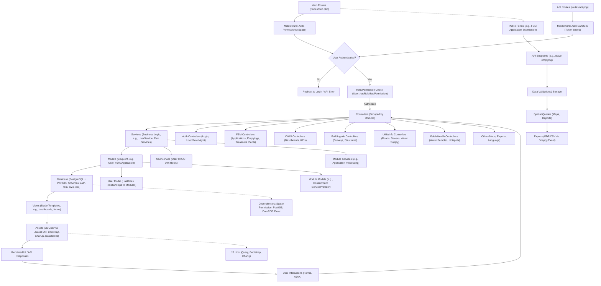

# BASE IMIS

This repository hosts the source code for the IMIS web application, along with essential resources such as technical documentation, ERD, data dictionary, GeoServer guides, and more.

Please refer to the deployment documentation maintained in the GitHub organization under the repository deployment_documentation for detailed instructions on the process.

[Follow the link to View Deployment Documentation.](https://github.com/base-imis/deployment_documentation)

### Codebase Analysis: Mermaid Diagram of Code Flow

Based on the Laravel-based IMIS (Integrated Municipal Information System) codebase, I've analyzed the structure, focusing on entry points (routes), dependencies (framework/packages), and critical paths (authentication, role-based access, data flow). The app is modular, with core modules like FSM (Fecal Sludge Management), CWIS (City-Wide Inclusive Sanitation), Building Info, Utility Info, and Public Health. It uses PostgreSQL with PostGIS for spatial data, Spatie Laravel Permission for RBAC, and Laravel Sanctum for API auth.

Key Insights from Analysis:
- **Language/Framework**: PHP/Laravel 8, with JavaScript (jQuery/Bootstrap/Chart.js) for frontend.
- **Architecture**: MVC with service layer for business logic. Modules are organized in subdirectories (e.g., Fsm, Fsm).
- **Entry Points**: Web routes (e.g., landing page, auth-protected dashboards) and API routes (e.g., login, data retrieval for mobile/web clients).
- **Dependencies**: Laravel core, Spatie Permission (roles/permissions), DomPDF/Snappy (PDF generation), Maatwebsite Excel (exports), Yajra DataTables (grids), and spatial libs (PostGIS).
- **Critical Paths**: User authentication → Role/permission checks → Module access (e.g., FSM applications flow through controllers → services → models → DB). Public forms/API endpoints bypass auth for submissions. Data exports and maps rely on spatial queries.
- **Modules Overview**: ~10 modules (FSM, CWIS, etc.), each with controllers, models, and views. Shared components like Auth, Helpers, and Enums.

#### Mermaid Diagram
The diagram below visualizes the high-level flow. It starts from entry points, passes through middleware/guards, processes via controllers/services, interacts with models/DB, and renders outputs. Arrows indicate dependencies and data flow; critical paths are highlighted in bold.

#### Explanation of Diagram Elements
- **Entry Points**: Routes define access. Web routes handle browser requests (e.g., dashboards); API routes handle programmatic access (e.g., mobile apps submitting emptying data).
- **Dependencies**: Laravel provides MVC; Spatie handles RBAC; PostGIS enables spatial features (e.g., map queries); JS libs power interactive UI (e.g., DataTables for grids).
- **Critical Paths**:
  - **Authentication Flow**: Login → Middleware checks → Role validation → Access modules. Failure redirects/errors.
  - **Data CRUD**: Controllers receive requests → Services apply logic (e.g., validate FSM applications) → Models interact with DB (e.g., save containments) → Views render or APIs respond.
  - **Public/Public API Paths**: Unauthenticated routes (e.g., public FSM forms) → Direct to controllers → DB storage → Responses. Bypasses role checks.
  - **Spatial/Data Export Paths**: Modules like Maps/Controllers query PostGIS → Generate reports/PDFs via DomPDF/Snappy → Export CSVs via Maatwebsite Excel.
  - **Module-Specific**: FSM is central (applications → emptyings → treatment); others (e.g., CWIS KPIs) depend on shared models.
- **Modules & Flow**: Controllers are namespaced (e.g., `App\Http\Controllers\Fsm\ApplicationController`). Services encapsulate logic; Models use Eloquent with relationships (e.g., User belongsTo ServiceProvider).
- **Potential Bottlenecks**: DB queries (spatial joins), permission checks (cached but role-heavy), asset compilation (Mix).

This diagram is adaptable; if you need a deeper dive into a specific module (e.g., FSM flow), provide more details! For build/run, see previous response.