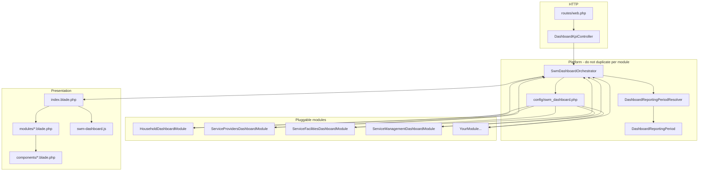
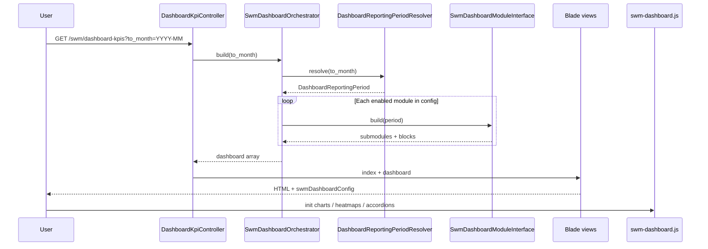

# SWM Dashboard — Data Flow & Architecture

A developer guide to the Solid Waste Management (SWM) **Dashboard and KPIs** page: how requests flow through the stack, how **modules** plug in, and how to add new metrics without changing the core orchestrator.

---

## Table of contents

1. [Overview](#overview)
2. [Architecture at a glance](#architecture-at-a-glance)
3. [Current modules](#current-modules)
4. [Request flow](#request-flow)
5. [Core platform (shared by all modules)](#core-platform-shared-by-all-modules)
6. [Module contract & payload schema](#module-contract--payload-schema)
7. [Block and chart types](#block-and-chart-types)
8. [Date filtering strategies](#date-filtering-strategies)
9. [Frontend rendering](#frontend-rendering)
10. [Adding a new dashboard module](#adding-a-new-dashboard-module)
11. [Adding charts, KPIs, and submodules](#adding-charts-kpis-and-submodules)
12. [Adding a new chart type (platform)](#adding-a-new-chart-type-platform)
13. [File reference](#file-reference)
14. [Tests](#tests)
15. [Common questions](#common-questions)

---

## Overview

The dashboard answers one user question:

> **Show me SWM metrics from the beginning of recorded data through the end of the month I select.**

Execution is split into a **fixed platform** and **pluggable modules**:

| Layer | Responsibility |
|-------|----------------|
| **Controller** | Auth, read `to_month`, return HTML or JSON |
| **Orchestrator** | Resolve reporting period, load enabled modules, merge output |
| **Period resolver** | Clamp month, build per-source reporting windows (where used) |
| **Modules** | Domain queries, KPI math, chart/tile payloads |
| **Blade + CSS + JS** | Layout, accordions, Chart.js, heatmaps, month filter |

**Server-rendered:** tile and KPI values are in HTML on first paint.  
**Client-rendered:** charts and ward heatmaps use JSON in `data-chart` / `data-heatmap` attributes.

Modules are registered in [`config/swm_dashboard.php`](../../config/swm_dashboard.php). The page loops config entries and includes each module’s Blade view—no change to routes or controller when adding a module.

---

## Architecture at a glance



---

## Current modules

Registered in [`config/swm_dashboard.php`](../../config/swm_dashboard.php) (order = display order on the page).

| Config key | Class | Accordion label | Blade view | Permission |
|------------|-------|-----------------|------------|------------|
| `households` | `HouseholdDashboardModule` | Households & LIC | `swm.dashboard.modules.households` | `null` (page gate only) |
| `service_providers` | `ServiceProvidersDashboardModule` | Service Providers | `swm.dashboard.modules.service-providers` | `null` |
| `service_facilities` | `ServiceFacilitiesDashboardModule` | Service Facilities | `swm.dashboard.modules.service-facilities` | `null` |
| `service_management` | `ServiceManagementDashboardModule` | Service Management | `swm.dashboard.modules.service-management` | `null` |

### `households` — Households & LIC

**File:** `app/Services/Swm/Dashboard/Modules/HouseholdDashboardModule.php`

| Submodule key | Title | Blocks |
|---------------|-------|--------|
| `municipality` | Municipality Overview | Tiles → Charts (ward bar, waste-bin doughnut) |
| `waste_generation` | Waste Generation & Collection | Tiles → KPIs → Charts (ward bars, functional-use doughnut, segregation heatmap) |
| `lic` | LIC | Tiles → Charts (gender doughnut) |

**Date logic:** Uses `BuildsCumulativeDateQueries` and **per-source reporting windows** (`SOURCE_HOUSEHOLD`, `SOURCE_LANDFILL`, `SOURCE_COMPLAINT`) for landfill disposal and complaint KPIs. Uses `SwmModuleSettingsService` for per-capita generation.

### `service_providers` — Service Providers

**File:** `app/Services/Swm/Dashboard/Modules/ServiceProvidersDashboardModule.php`

| Submodule key | Title | Blocks |
|---------------|-------|--------|
| `overview` | Overview | Tiles (org count, worker count) → Charts |

**Charts:** Organization category (doughnut), workers by type (bar), workers by ward & organization (stacked bar), gender (doughnut), age buckets (bar), employment type (doughnut), education level (bar).

**Date logic:** Cumulative through `periodEnd` on `created_at` (`whereThroughPeriodEnd`). Counts **operational** organizations and **active** workers. Respects `Auth::user()->swm_organization_id` when set.

### `service_facilities` — Service Facilities

**File:** `app/Services/Swm/Dashboard/Modules/ServiceFacilitiesDashboardModule.php`

| Submodule key | Title | Blocks |
|---------------|-------|--------|
| `overview` | Overview | Tiles → KPIs → Charts |

**Charts:** Waste bins by type, household-to-bin ratio by ward, bin placement, vehicles by type, fleet capacity by ward (stacked bar), fuel type, STS capacity adequacy, STS/landfill waste type distributions.

**Date logic:** Cumulative through `periodEnd` on facility `created_at`. Optional org scope on vehicles where applicable.

### `service_management` — Service Management

**File:** `app/Services/Swm/Dashboard/Modules/ServiceManagementDashboardModule.php`

| Submodule key | Title | Blocks |
|---------------|-------|--------|
| `attendance` | Attendance | Tile (avg working hours) → Charts (30-day trend line, org bar, department horizontal bar) |
| `sts_loading` | STS Loading | Tile (daily STS receipts) → Charts (30-day trend line, receipts by STS horizontal bar, ward→STS stacked bar) |
| `landfill_loading` | Landfill Loading | Tiles (daily/monthly receipts) → Charts (30-day trend line, ward→landfill stacked bar, STS→landfill stacked bar, catchment network) |
| `waste_processing` | Waste Processing | Tiles (received ton) → KPIs (six monthly % rates) → Charts (distribution doughnut, 12-month stacked area) |

**Date logic:** Attendance uses `entry_at` (30-day charts; selected month for working-hours tile). STS/landfill logs use `operation_date` with **`operation_status = completed`**; ton tiles use selected reporting month; 30-day charts end at `periodEnd`. Waste processing uses `reporting_month` (first of month). Landfill ton uses `COALESCE(weighbridge_weight_ton, quantity_ton, 0)`.

**Scope:** Attendance filtered by `organization_id` when user has `swm_organization_id`. STS/landfill logs scoped via `vehicle.organization_id`.

---

## Request flow



### Routes

Defined in `routes/web.php` (SWM prefix):

| Route name | Method | Handler | Purpose |
|------------|--------|---------|---------|
| `swm.dashboard-kpis.index` | GET | `DashboardKpiController@index` | Full page |
| `swm.dashboard-kpis.data` | GET | `DashboardKpiController@data` | Same payload as JSON |
| `swm.dashboard-kpis.ward-geometries` | GET | `DashboardKpiController@wardGeometries` | Ward GeoJSON (map-related) |

**Access:** `auth` middleware + permission **List SW Dashboard and KPIs**.

---

## Core platform (shared by all modules)

### Controller

`app/Http/Controllers/Swm/DashboardKpiController.php` — reads `to_month`, calls `SwmDashboardOrchestrator::build()`, returns view or JSON. No domain queries here.

### Orchestrator

`app/Services/Swm/Dashboard/SwmDashboardOrchestrator.php`

1. Resolve `DashboardReportingPeriod`
2. Iterate `config('swm_dashboard.modules')`
3. Skip if `enabled` is false, class missing, or `permission()` denied
4. Call `$module->build($period)` and merge into `modules` / `moduleViews`
5. Flatten chart definitions into top-level `charts` (for `window.swmDashboardConfig`)
6. Attach `period` metadata and `map` config

### Period resolver

`app/Services/Swm/Dashboard/DashboardReportingPeriodResolver.php`

- **Default month:** previous calendar month (not current/future)
- **Clamp:** URL `to_month` and `config('swm_dashboard.default_to_month')` cannot exceed latest allowed month
- **Windows:** earliest DB date per household / landfill log / complaint → `ReportingWindow` through `periodEnd`

`DashboardReportingPeriod` and `ReportingWindow` are value objects in `app/Services/Swm/Dashboard/`.

**Returned `period` keys (in view/API):**

| Key | Meaning |
|-----|---------|
| `to_month` | Selected month `Y-m` |
| `period_end` | Last day of that month |
| `max_to_month` | Max selectable month (for `<input type="month" max="...">`) |
| `reporting_days` | Household window days (legacy alias) |
| `household_days` / `landfill_days` / `complaint_days` | Per-source window day counts |

Modules that do not use windows can ignore window fields and only use `$period->periodEnd`.

### Shared helpers

| Component | Role |
|-----------|------|
| `SwmDashboardFormatter` | `integer()`, `decimal()`, `percent()`, etc. |
| `SwmModuleSettingsService` | Module settings (e.g. per-capita kg/day for households) |
| `BuildsCumulativeDateQueries` | `whereThroughPeriodEnd`, `whereWithinWindow` |

---

## Module contract & payload schema

### Interface

`app/Services/Swm/Dashboard/Contracts/SwmDashboardModuleInterface.php`

| Method | Purpose |
|--------|---------|
| `key()` | Must match config array key (e.g. `service_providers`) |
| `label()` | Accordion banner title |
| `build(DashboardReportingPeriod $period)` | Returns metrics structure (below) |
| `permission()` | Optional `can()` permission name; `null` = no extra gate |

### Return shape

Every module returns:

```php
[
    'submodules' => [
        [
            'key' => 'overview',           // unique within module
            'title' => __('Overview'),
            'blocks' => [ /* see below */ ],
        ],
        // more submodules...
    ],
]
```

The orchestrator adds `'label' => $module->label()` when merging into `$dashboard['modules'][$key]`.

### Orchestrator output (`$dashboard`)

```php
[
    'period' => [ /* to_month, period_end, max_to_month, *_days */ ],
    'modules' => [
        'your_key' => [
            'label' => '...',
            'submodules' => [ /* from module */ ],
        ],
    ],
    'moduleViews' => [
        'your_key' => 'swm.dashboard.modules.your_module',
    ],
    'charts' => [ /* flat list of all chart items with id */ ],
    'map' => [ /* GeoServer / ward geometries */ ],
]
```

---

## Block and chart types

Rendered by [`resources/views/swm/dashboard/components/submodule.blade.php`](../../resources/views/swm/dashboard/components/submodule.blade.php). Each **block** is wrapped in `.swm-metric-block` for consistent vertical spacing.

### Blocks

| `type` | Optional `subsection` | Renders |
|--------|----------------------|---------|
| `tiles` | No (usually) | Info boxes — `label`, `value`, `icon` |
| `kpis` | Often “Key Performance Indicators” | KPI cards — `name`, `value`, `unit`, `showFrequency`, `hideUnit` |
| `charts` | Often “Visualizations” | Grid of chart cards |

### Chart `type` values (Chart.js / custom)

| `type` | Width | JS handler |
|--------|-------|------------|
| `bar` | half (`col-md-6`) | `renderBar()` |
| `doughnut` | half | `renderDoughnut()` |
| `stackedBar` | full (`col-md-12`) | `renderStackedBar()` — multiple `datasets` |
| `line` | half | `renderLine()` — time series (%, ton) |
| `horizontalBar` | half | `renderHorizontalBar()` — Chart.js 2.x `horizontalBar` |
| `stackedArea` | full | `renderStackedArea()` — stacked line fill |
| `network` | full | `initNetworks()` — vis-network graph (`nodes`, `edges`) |
| `heatmap` | full | `initHeatmaps()` — ward grid, not Chart.js |

**Common chart fields:** `id` (unique globally), `title`, `labels`, `datasets`, `options` (`unitX`, `unitY`, `stacked`), optional `height`.

**Heatmap fields:** `wards`, `values`, `rowLabel`, `options.unit`.

**Example bar chart definition:**

```php
[
    'id' => 'swmChartExample',
    'type' => 'bar',
    'title' => __('Example by Ward'),
    'labels' => ['1', '2', '3'],
    'datasets' => [
        ['label' => __('Count'), 'data' => [10, 20, 15]],
    ],
    'options' => ['unitX' => __('Ward'), 'unitY' => __('Count')],
]
```

---

## Date filtering strategies

Choose one pattern per metric; document it in your module class.

| Strategy | Helper | Use when |
|----------|--------|----------|
| **Through period end** | `whereThroughPeriodEnd($query, $column, $period)` | Snapshot / cumulative counts: “records that existed by end of selected month” (`created_at <= periodEnd`) |
| **Within source window** | `whereWithinWindow($query, $column, $window)` | Rates over days when a source has data (household, landfill, complaint windows) |
| **Custom SQL** | — | JSON ward expansion, cross-schema joins, etc. |

Reporting windows are built only for household, landfill, and complaint sources today. New time-series sources can extend `DashboardReportingPeriod` and the resolver if needed.

**Month rules:** default and max selectable month = previous calendar month; current/future months are clamped server- and client-side.

---

## Frontend rendering

### Page shell

[`resources/views/swm/dashboard/index.blade.php`](../../resources/views/swm/dashboard/index.blade.php)

- Page header + **To month** filter (`#swm-dashboard-filter-form`)
- Loops `$dashboard['modules']` and `@include($dashboard['moduleViews'][$key])`

### View hierarchy

```
index.blade.php
└── modules/{key}.blade.php          ← accordion (.dash-section)
    └── components/metrics-body.blade.php
        └── components/submodule.blade.php   ← per submodule
            ├── components/tile.blade.php
            ├── components/kpi.blade.php
            └── components/chart-card.blade.php
```

**Module blade template** (minimal—copy from an existing module):

```blade
<section class="dash-section" id="sec-your-module-id">
    <div class="section-banner swm-module-toggle" role="button" tabindex="0" aria-expanded="true">
        <span>{{ $module['label'] }}</span>
        <i class="fas fa-chevron-up section-chevron"></i>
    </div>
    <div class="section-content">
        @include('swm.dashboard.components.metrics-body', ['module' => $module])
    </div>
</section>
```

### Assets

| Asset | Role |
|-------|------|
| `public/css/swm-dashboard.css` | Layout, gutters, accordions, heatmap grid |
| `resources/js/swm-dashboard.js` → `public/js/swm-dashboard.js` | Charts, heatmaps, filter, accordions (copied via Mix) |
| `Chart.min.js` | Loaded from `index.blade.php` |

**Month change:** Apply → `fetch(dataUrl)` → full page reload with `?to_month=` (server re-renders all tiles/KPIs).

---

## Adding a new dashboard module

Checklist for a new domain area (e.g. billing, attendance):

### 1. Create the module class

Path: `app/Services/Swm/Dashboard/Modules/YourDashboardModule.php`

```php
<?php

namespace App\Services\Swm\Dashboard\Modules;

use App\Services\Swm\Dashboard\Concerns\BuildsCumulativeDateQueries;
use App\Services\Swm\Dashboard\Contracts\SwmDashboardModuleInterface;
use App\Services\Swm\Dashboard\DashboardReportingPeriod;
use App\Services\Swm\Dashboard\SwmDashboardFormatter;

class YourDashboardModule implements SwmDashboardModuleInterface
{
    use BuildsCumulativeDateQueries;

    public function __construct(
        protected SwmDashboardFormatter $formatter,
    ) {}

    public function key(): string
    {
        return 'your_key'; // must match config key
    }

    public function label(): string
    {
        return __('Your Section Title');
    }

    public function permission(): ?string
    {
        return null; // or 'Some Permission'
    }

    public function build(DashboardReportingPeriod $period): array
    {
        return [
            'submodules' => [
                [
                    'key' => 'overview',
                    'title' => __('Overview'),
                    'blocks' => [
                        [
                            'type' => 'tiles',
                            'items' => [
                                [
                                    'label' => __('Total Items'),
                                    'value' => $this->formatter->integer(0),
                                    'icon' => 'fa-chart-bar',
                                ],
                            ],
                        ],
                        // Add kpis / charts blocks as needed
                    ],
                ],
            ],
        ];
    }
}
```

### 2. Register in config

[`config/swm_dashboard.php`](../../config/swm_dashboard.php):

```php
'your_key' => [
    'class' => \App\Services\Swm\Dashboard\Modules\YourDashboardModule::class,
    'view' => 'swm.dashboard.modules.your-module',
    'permission' => null,
    'enabled' => true,
],
```

### 3. Add the module Blade view

`resources/views/swm/dashboard/modules/your-module.blade.php` — copy from [`households.blade.php`](../../resources/views/swm/dashboard/modules/households.blade.php), change section `id` and rely on `$module['label']`.

### 4. Implement queries and payloads

- Inject models/services as needed
- Use `SwmDashboardFormatter` for display values
- Use unique chart `id` values prefixed e.g. `swmChartYour...`
- Apply date filters via `BuildsCumulativeDateQueries` or windows

### 5. Add tests (recommended)

`tests/Unit/YourDashboardModuleTest.php` — assert tile values and chart shapes for fixture data (see `ServiceProvidersDashboardModuleTest.php`).

### 6. Verify in browser

- `/swm/dashboard-kpis` — new accordion section appears
- Change month — metrics update after reload
- Collapse/expand accordion — charts init when expanded (accordion click re-runs `initCharts()`)

**You do not need to change:** `DashboardKpiController`, `SwmDashboardOrchestrator`, routes, or `index.blade.php` (unless adding page-level behavior).

---

## Adding charts, KPIs, and submodules

Within an **existing** module, extend `build()` only.

### Add a submodule

Add another element to the `submodules` array with a new `key` and `title`.

### Add a block to a submodule

Append to `blocks`:

```php
[
    'type' => 'charts',
    'subsection' => __('Visualizations'),
    'items' => [
        $this->myNewChart($period),
    ],
],
```

### Add a chart method

Return a chart array from a protected method; keep `id` globally unique across all modules.

### Add KPIs or tiles

Same `blocks` pattern with `type` => `kpis` or `tiles` and `items` array.

---

## Adding a new chart type (platform)

Only when `bar`, `doughnut`, `stackedBar`, and `heatmap` are not enough:

1. Define the new `type` string in module chart payloads
2. Branch in `initCharts()` / new init function in [`resources/js/swm-dashboard.js`](../../resources/js/swm-dashboard.js)
3. Update [`chart-card.blade.php`](../../resources/views/swm/dashboard/components/chart-card.blade.php) if markup differs (e.g. full-width column)
4. Copy JS to `public/js/swm-dashboard.js` (webpack Mix)

---

## File reference

### Platform (shared)

| File | Role |
|------|------|
| `config/swm_dashboard.php` | Module registry |
| `routes/web.php` | Dashboard routes |
| `app/Http/Controllers/Swm/DashboardKpiController.php` | HTTP entry |
| `app/Services/Swm/Dashboard/SwmDashboardOrchestrator.php` | Build coordinator |
| `app/Services/Swm/Dashboard/DashboardReportingPeriodResolver.php` | Month + windows |
| `app/Services/Swm/Dashboard/DashboardReportingPeriod.php` | Period value object |
| `app/Services/Swm/Dashboard/ReportingWindow.php` | Per-source window |
| `app/Services/Swm/Dashboard/Contracts/SwmDashboardModuleInterface.php` | Module contract |
| `app/Services/Swm/Dashboard/Concerns/BuildsCumulativeDateQueries.php` | Date query helpers |
| `app/Services/Swm/Dashboard/SwmDashboardFormatter.php` | Number formatting |

### Modules (current)

| File |
|------|
| `app/Services/Swm/Dashboard/Modules/HouseholdDashboardModule.php` |
| `app/Services/Swm/Dashboard/Modules/ServiceProvidersDashboardModule.php` |
| `app/Services/Swm/Dashboard/Modules/ServiceFacilitiesDashboardModule.php` |
| `app/Services/Swm/Dashboard/Modules/ServiceManagementDashboardModule.php` |

### Frontend

| File | Role |
|------|------|
| `resources/views/swm/dashboard/index.blade.php` | Page + filter |
| `resources/views/swm/dashboard/modules/*.blade.php` | Module accordions |
| `resources/views/swm/dashboard/components/*.blade.php` | Tiles, KPIs, charts |
| `resources/js/swm-dashboard.js` | Client behavior |
| `public/css/swm-dashboard.css` | Styles |

---

## Tests

| File | Covers |
|------|--------|
| `tests/Unit/DashboardReportingPeriodResolverTest.php` | Month default, clamping, windows |
| `tests/Unit/ReportingWindowTest.php` | Day counting, empty window |
| `tests/Unit/SwmDashboardFormatterTest.php` | Formatting helpers |
| `tests/Unit/ServiceProvidersDashboardModuleTest.php` | Service providers module output |
| `tests/Unit/ServiceManagementDashboardModuleTest.php` | Service management module output |

Add module-specific tests when introducing new modules.

---

## Common questions

### Why is there only one “Resolver”?

It resolves the reporting **period** from user input and DB facts. Modules and the orchestrator handle domain logic; value objects hold period/windows.

### Why does changing month reload the whole page?

Tiles and KPIs are server-rendered. JSON `data` validates the build, then the browser navigates with `?to_month=` so all modules recompute consistently.

### Do charts fetch data on a separate API?

No on initial load. Data is embedded in `data-chart` / `data-heatmap`. The flat `charts` array in `swmDashboardConfig` is available for future use.

### Can I disable a module without deleting code?

Set `'enabled' => false` in `config/swm_dashboard.php`.

### How do I restrict a module to certain users?

Return a permission name from `permission()` and ensure roles have that ability. The page still requires **List SW Dashboard and KPIs**.

### What if my module does not need reporting windows?

Use only `$period->periodEnd` (and optionally `whereThroughPeriodEnd`). Windows are optional for modules.

---

*Last updated for the modular dashboard architecture with households, service providers, service facilities, and service management modules.*
