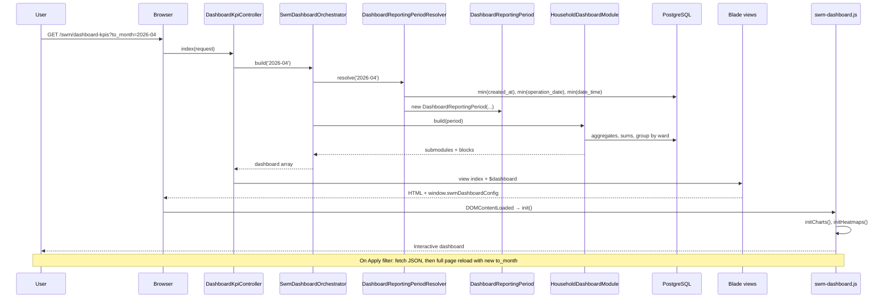
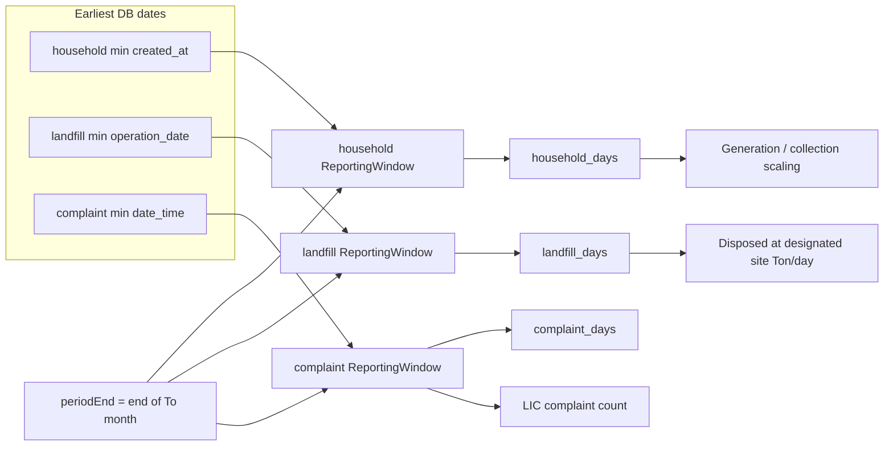

# SWM Dashboard — Data Flow & Architecture

A detailed guide to how the Solid Waste Management (SWM) **Dashboard and KPIs** page prepares and displays data, from the HTTP request through backend services to Blade templates and browser JavaScript.

Written for developers and stakeholders who want both the **big picture** and **where to change things**.

---

## Table of contents

1. [Overview in plain language](#overview-in-plain-language)
2. [End-to-end sequence](#end-to-end-sequence)
3. [Routes and entry points](#routes-and-entry-points)
4. [Backend layers](#backend-layers)
   - [Controller](#1-controller-dashboardkpicontroller)
   - [Orchestrator](#2-orchestrator-swmdashboardorchestrator)
   - [Period resolver](#3-period-resolver-dashboardreportingperiodresolver)
   - [Reporting period & windows](#4-reporting-period--windows)
   - [Dashboard modules](#5-dashboard-modules)
   - [Supporting services](#6-supporting-services)
5. [Data structure returned to the view](#data-structure-returned-to-the-view)
6. [Frontend layers](#frontend-layers)
   - [Blade rendering](#blade-rendering)
   - [JavaScript behavior](#javascript-behavior)
7. [Worked example](#worked-example)
8. [Month selection rules](#month-selection-rules)
9. [Per-source reporting windows](#per-source-reporting-windows)
10. [File reference](#file-reference)
11. [Extending the dashboard](#extending-the-dashboard)
12. [Common questions](#common-questions)

---

## Overview in plain language

When a user opens the dashboard, they are really asking:

> **“Show me waste and household statistics from when we started recording, up through the end of the month I pick.”**

The system does this in four broad steps:

| Step | Where | What happens |
|------|--------|----------------|
| 1 | **Controller** | Receives the request, checks auth, reads `to_month` from the URL |
| 2 | **Period resolver** | Decides which month is allowed, and how many “reporting days” apply per data source (household, landfill, complaints) |
| 3 | **Modules** | Run SQL, compute KPIs, build chart definitions as PHP arrays |
| 4 | **Blade + JS** | Print HTML (tiles, KPI cards, chart placeholders); JavaScript draws charts and the ward heatmap |

**Important:** Most numbers (tiles, KPI values) are computed on the **server** and appear in HTML immediately. **Charts** and the **segregation heatmap** are rendered in the browser using JSON embedded in `data-*` attributes.

---

## End-to-end sequence



---

## Routes and entry points

Defined in `routes/web.php` (under the SWM prefix):

| Route name | Method | Handler | Purpose |
|------------|--------|---------|---------|
| `swm.dashboard-kpis.index` | GET | `DashboardKpiController@index` | Full HTML page |
| `swm.dashboard-kpis.data` | GET | `DashboardKpiController@data` | Same payload as JSON (used when changing month) |
| `swm.dashboard-kpis.ward-geometries` | GET | `DashboardKpiController@wardGeometries` | GeoJSON ward boundaries (optional / map-related) |

All dashboard routes require:

- Authentication (`auth` middleware)
- Permission: **List SW Dashboard and KPIs**

---

## Backend layers

### 1. Controller (`DashboardKpiController`)

**File:** `app/Http/Controllers/Swm/DashboardKpiController.php`

Thin entry point:

```php
public function index(Request $request)
{
    $page_title = __('Dashboard and KPIs');
    $dashboard = $this->orchestrator->build($request->input('to_month'));

    return view('swm.dashboard.index', compact('page_title', 'dashboard'));
}

public function data(Request $request)
{
    return response()->json($this->orchestrator->build($request->input('to_month')));
}
```

**Responsibilities:**

- Read optional `to_month` query parameter (`YYYY-MM`)
- Delegate all logic to `SwmDashboardOrchestrator`
- Return either a Blade view or JSON

The controller does **not** query households or compute KPIs itself.

---

### 2. Orchestrator (`SwmDashboardOrchestrator`)

**File:** `app/Services/Swm/Dashboard/SwmDashboardOrchestrator.php`

Acts as the **project manager** for the dashboard build.

**Flow:**

1. Call `DashboardReportingPeriodResolver::resolve($toMonthInput)` → get `DashboardReportingPeriod`
2. Read enabled modules from `config/swm_dashboard.php`
3. For each module:
   - Skip if disabled or class missing
   - Instantiate module (e.g. `HouseholdDashboardModule`)
   - Skip if user lacks module permission
   - Call `$module->build($period)`
4. Merge module output into `modules`, track Blade view names in `moduleViews`
5. Flatten all chart definitions into top-level `charts` (for JS config)
6. Attach `period` metadata and `map` config

**Returned `period` keys:**

| Key | Meaning |
|-----|---------|
| `to_month` | Resolved selected month (`Y-m`) |
| `period_end` | Last calendar day of that month |
| `max_to_month` | Latest month the user is allowed to pick (previous calendar month) |
| `reporting_days` | Household window day count (backward-compatible alias) |
| `household_days` | Days in household reporting window |
| `landfill_days` | Days in landfill reporting window |
| `complaint_days` | Days in complaint reporting window |

---

### 3. Period resolver (`DashboardReportingPeriodResolver`)

**File:** `app/Services/Swm/Dashboard/DashboardReportingPeriodResolver.php`

This is the **only** class named “Resolver” in the dashboard stack. It answers all **time-related** questions before any KPI math runs.

#### 3.1 Choosing the “To month”

Method: `parseToMonth(?string $toMonthInput)`

| Input | Behavior |
|-------|----------|
| Valid `YYYY-MM` in URL | Parsed, then **clamped** to `latestAllowedToMonth()` |
| Invalid / missing | Default = **previous calendar month** |
| `config('swm_dashboard.default_to_month')` | Used if set, also clamped |

**Month bounds (business rules):**

- Users cannot select the **current** month or any **future** month
- Latest allowed = `now()->subMonth()->startOfMonth()`
- Example: if today is 17 May 2026, default and max are **April 2026** (`2026-04`)

Public helpers:

- `latestAllowedToMonth(): Carbon`
- `latestAllowedToMonthString(): string` — for Blade `max` attribute and API
- `clampToMonth(Carbon $month): Carbon` — caps future/current selections

#### 3.2 Building per-source windows

For the resolved month, the resolver queries the **earliest record** per source:

| Source constant | DB query | Column |
|-----------------|----------|--------|
| `SOURCE_HOUSEHOLD` | `Household::query()->min('created_at')` | When first household was created |
| `SOURCE_LANDFILL` | `LandfillLog::query()->min('operation_date')` | First landfill log date |
| `SOURCE_COMPLAINT` | `Complaint::query()->min('date_time')` | First complaint date |

Each min date is passed to `resolveWindow($periodEnd, $minDate)`:

- If min exists → `ReportingWindow::between($epoch, $periodEnd)`
- If no rows → `ReportingWindow::empty($periodEnd)` → **0 days**, no epoch

`periodEnd` is always **end of the selected month** (e.g. 30 Apr 2026 23:59:59).

---

### 4. Reporting period & windows

#### `DashboardReportingPeriod`

**File:** `app/Services/Swm/Dashboard/DashboardReportingPeriod.php`

Immutable value object holding:

- `toMonth` — start of selected month
- `periodEnd` — end of selected month
- Three `ReportingWindow` instances (household, landfill, complaint)

Access:

```php
$period->window(DashboardReportingPeriod::SOURCE_LANDFILL)->days;
$period->reportingDays(); // same as household window days
```

Passed into every module’s `build()` method so modules share one consistent time context.

#### `ReportingWindow`

**File:** `app/Services/Swm/Dashboard/ReportingWindow.php`

Describes one data source’s counting range:

| Property | Description |
|----------|-------------|
| `epoch` | Start date (`null` if source has no data) |
| `periodEnd` | End of selected month |
| `days` | Inclusive day count (`0` if empty) |

Factories:

- `ReportingWindow::between($epoch, $periodEnd)` → `days = max(1, diffInDays + 1)`
- `ReportingWindow::empty($periodEnd)` → `epoch = null`, `days = 0`
- `hasData()` → `days > 0`

**Why separate windows?**  
Household, landfill, and complaints may start on different dates. Using one global “first record ever” would skew landfill daily averages (e.g. 34 days instead of 19 when landfill started mid-month).

---

### 5. Dashboard modules

#### Contract

**File:** `app/Services/Swm/Dashboard/Contracts/SwmDashboardModuleInterface.php`

Every module implements:

| Method | Purpose |
|--------|---------|
| `key()` | Config key (e.g. `households`) |
| `label()` | Section title |
| `build(DashboardReportingPeriod $period)` | Returns structured metrics array |
| `permission()` | Optional gate; `null` = everyone |

#### Current module: `HouseholdDashboardModule`

**File:** `app/Services/Swm/Dashboard/Modules/HouseholdDashboardModule.php`  
**Config:** `config/swm_dashboard.php` → `modules.households`  
**View:** `resources/views/swm/dashboard/modules/households.blade.php`

**Uses trait:** `BuildsCumulativeDateQueries` for date-scoped Eloquent/DB queries.

**Submodules produced:**

| Submodule key | Title | Contents |
|---------------|-------|----------|
| `municipality` | Municipality Overview | Population/household tiles; bar chart by ward; waste bin doughnut |
| `waste_generation` | Waste Generation & Collection | Generation tiles; KPI row; ward bar charts; functional-use doughnut; segregation heatmap |
| `lic` | LIC | LIC population tiles; gender doughnut; complaint density |

**Block types inside each submodule:**

| `type` | Rendered as | Data shape |
|--------|-------------|------------|
| `tiles` | Info boxes with icon | `label`, `value`, `icon` |
| `kpis` | KPI cards | `name`, `value`, `unit`, `showFrequency` |
| `charts` | Chart card → canvas or heatmap div | Chart.js config or heatmap `wards` + `values` |

**Example KPI logic (waste generation):**

- **Daily generation (Ton/day):** `perCapitaKg × activeMembers / 1000`
- **Collected (Ton/day):** sum of active households’ `daily_waste_volume` / 1000
- **Disposed at designated site (Ton/day):** sum landfill tonnage within **landfill window** ÷ **landfill days**
- **Non-designated (Ton/day):** `max(0, collectedDailyTon - disposedDailyTon)`
- **Uncollected (Ton/day):** `max(0, dailyGenTon - collectedDailyTon)`
- **% Collected:** collected daily kg vs estimated generation (can exceed 100% if reported collection exceeds model)

**Landfill total query** (`landfillDisposedTon`):

- Short-circuit `0` if landfill window has no data
- Else `whereWithinWindow` on `operation_date` (>= epoch, <= periodEnd)
- Sum `weighbridge_weight_ton` or `quantity_ton`

**Complaint count** (`licComplaintCount`):

- Short-circuit `0` if complaint window empty
- Filter complaints in window, joined to LIC households

---

### 6. Supporting services

#### `SwmDashboardFormatter`

**File:** `app/Services/Swm/Dashboard/SwmDashboardFormatter.php`

Display-only formatting: `integer()`, `decimal()`, `percent()`, `percentValue()`, `safePercent()`.

#### `SwmModuleSettingsService`

**File:** `app/Services/Swm/SwmModuleSettingsService.php`

Provides settings such as **per-capita waste generation (kg/day)** used in formulas.

#### `BuildsCumulativeDateQueries` (trait)

**File:** `app/Services/Swm/Dashboard/Concerns/BuildsCumulativeDateQueries.php`

| Method | SQL effect |
|--------|------------|
| `whereThroughPeriodEnd($query, $column, $period)` | `column <= periodEnd` |
| `whereWithinWindow($query, $column, $window)` | `column >= epoch AND column <= periodEnd` (only if window has data) |

---

## Data structure returned to the view

Simplified shape of `$dashboard`:

```php
[
    'period' => [
        'to_month' => '2026-04',
        'period_end' => '2026-04-30',
        'max_to_month' => '2026-04',
        'reporting_days' => 34,
        'household_days' => 34,
        'landfill_days' => 19,
        'complaint_days' => 12,
    ],
    'modules' => [
        'households' => [
            'label' => 'Households & LIC',
            'submodules' => [
                [
                    'key' => 'waste_generation',
                    'title' => 'Waste Generation & Collection',
                    'blocks' => [
                        [
                            'type' => 'kpis',
                            'subsection' => 'Key Performance Indicators',
                            'items' => [
                                [
                                    'name' => 'SW Disposed at Designated Site',
                                    'value' => '1.20',
                                    'unit' => 'Ton/day',
                                    'showFrequency' => true,
                                ],
                                // ...
                            ],
                        ],
                        [
                            'type' => 'charts',
                            'subsection' => 'Visualizations',
                            'items' => [
                                [
                                    'id' => 'swmChartWasteGenByWard',
                                    'type' => 'bar',
                                    'title' => 'Daily Waste Generation by Ward',
                                    'labels' => ['1', '2', '3'],
                                    'datasets' => [['label' => 'Ton/day', 'data' => [1.2, 0.8, ...]]],
                                    'options' => ['unitX' => 'Ward', 'unitY' => 'Ton/day'],
                                ],
                                [
                                    'id' => 'swmSegregationHeatmap',
                                    'type' => 'heatmap',
                                    'title' => 'Segregation Rate by Ward (%)',
                                    'wards' => ['1', '2', ...],
                                    'values' => [45.2, 67.0, ...],
                                ],
                            ],
                        ],
                    ],
                ],
            ],
        ],
    ],
    'moduleViews' => [
        'households' => 'swm.dashboard.modules.households',
    ],
    'charts' => [ /* flat list of all chart items with ids */ ],
    'map' => [ /* GeoServer URLs, bbox, ward geometries route */ ],
]
```

---

## Frontend layers

### Blade rendering

**Page shell:** `resources/views/swm/dashboard/index.blade.php`

- Extends `layouts.dashboard`
- Month filter form: `#swm-dashboard-filter-form`, input `#to_month` with `max="{{ max_to_month }}"`
- Loops `$dashboard['modules']` and `@include`s each `moduleViews[$key]`

**Include chain:**

```
index.blade.php
  └── modules/households.blade.php
        └── components/metrics-body.blade.php
              └── components/submodule.blade.php
                    ├── components/tile.blade.php      (type: tiles)
                    ├── components/kpi.blade.php       (type: kpis)
                    └── components/chart-card.blade.php (type: charts)
```

**Chart embedding** (`chart-card.blade.php`):

- Bar/doughnut: `<canvas class="swm-chart-canvas" data-chart='@json($chart)'>`
- Heatmap: `<motion.div id="..." class="heatmap-wrap swm-heatmap" data-heatmap='@json($chart)'></motion.div>` — see `chart-card.blade.php` (empty `div` until JS fills the ward grid)

KPI and tile **values are already rendered in HTML** — no JavaScript required to see them.

**Script bootstrapping:**

```php
window.swmDashboardConfig = {
    dataUrl: '/swm/.../dashboard-kpis/data',
    period: { to_month, max_to_month, ... },
    charts: [ ... ],
};
```

Loads `Chart.min.js` and `public/js/swm-dashboard.js`.

### JavaScript behavior

**File:** `resources/js/swm-dashboard.js` (built/copied to `public/js/swm-dashboard.js`)

| Function | Role |
|----------|------|
| `initModuleAccordions()` | Toggle `.dash-section.collapsed` on banner click |
| `initCharts()` | Parse `data-chart` on each canvas; render via Chart.js (bar/doughnut) |
| `initHeatmaps()` | Parse `data-heatmap`; build ward grid HTML + color scale |
| `initExportButtons()` | PNG download from chart canvas |
| `clampToMaxMonth()` | On submit, if month > `max`, reset to max |
| `refreshDashboard(toMonth)` | `fetch(dataUrl)` then **full page redirect** with `?to_month=` |
| `bindFilterForm()` | Prevent default submit; run clamp + refresh |

**Note:** Changing the month does not update KPIs via AJAX in place. The flow fetches JSON (validation path) then reloads the entire page so Blade re-renders all server-computed values.

**Heatmap:** CSS grid (Ward 01–15 columns, Low→High legend), not OpenLayers on the main dashboard.

**Styles:** `public/css/swm-dashboard.css`

---

## Worked example

**Assumptions:**

- Today: **17 May 2026**
- User opens dashboard with no `to_month` in URL
- First household: **28 Apr 2026**
- First landfill log: **13 May 2026**
- User eventually selects **May 2026** (will be clamped)

### Step 1 — Default month

`parseToMonth(null)` → **April 2026** (`2026-04`)  
`periodEnd` → 2026-04-30 23:59:59

### Step 2 — Windows for April

| Source | Epoch | Days (approx.) |
|--------|-------|----------------|
| Household | 2026-04-28 | 3 (28–30 Apr) |
| Landfill | (none in April if first log is May 13) | 0 → disposal KPI = 0 |
| Complaint | (depends on data) | … |

If user selects **May 2026** (clamped to April in UI; if forced via URL for May):

- Household window: 28 Apr → 31 May → **34 days**
- Landfill window: 13 May → 31 May → **19 days**
- Disposed daily = (sum of May landfill logs in range) ÷ **19**

### Step 3 — Module output

`HouseholdDashboardModule` runs SQL aggregates, fills submodule blocks, formats numbers.

### Step 4 — Page render

User sees tiles immediately; charts draw after `initCharts()` runs.

---

## Month selection rules

| Rule | Implementation |
|------|----------------|
| Default month | Previous calendar month |
| Max selectable | Previous calendar month (`max` on `<input type="month">`) |
| Current/future in URL | Clamped server-side in `clampToMonth()` |
| Client submit | `clampToMaxMonth()` in JS before redirect |

---

## Per-source reporting windows



---

## File reference

### Backend

| File | Role |
|------|------|
| `routes/web.php` | Route definitions |
| `app/Http/Controllers/Swm/DashboardKpiController.php` | HTTP entry |
| `app/Services/Swm/Dashboard/SwmDashboardOrchestrator.php` | Coordinates build |
| `app/Services/Swm/Dashboard/DashboardReportingPeriodResolver.php` | Month + window resolution |
| `app/Services/Swm/Dashboard/DashboardReportingPeriod.php` | Period value object |
| `app/Services/Swm/Dashboard/ReportingWindow.php` | Per-source window value object |
| `app/Services/Swm/Dashboard/Modules/HouseholdDashboardModule.php` | Household/LIC metrics |
| `app/Services/Swm/Dashboard/Concerns/BuildsCumulativeDateQueries.php` | Date query helpers |
| `app/Services/Swm/Dashboard/SwmDashboardFormatter.php` | Number formatting |
| `app/Services/Swm/SwmModuleSettingsService.php` | Per-capita etc. |
| `config/swm_dashboard.php` | Module registry |

### Frontend

| File | Role |
|------|------|
| `resources/views/swm/dashboard/index.blade.php` | Page layout + filter |
| `resources/views/swm/dashboard/modules/households.blade.php` | Module section |
| `resources/views/swm/dashboard/components/*.blade.php` | Tiles, KPIs, charts |
| `resources/js/swm-dashboard.js` | Charts, heatmap, filter |
| `public/js/swm-dashboard.js` | Served asset |
| `public/css/swm-dashboard.css` | Dashboard styles |

### Tests

| File | Covers |
|------|--------|
| `tests/Unit/DashboardReportingPeriodResolverTest.php` | Month default, clamping, windows |
| `tests/Unit/ReportingWindowTest.php` | Day counting, empty window |

---

## Extending the dashboard

### Add a new module

1. Create class implementing `SwmDashboardModuleInterface` under `app/Services/Swm/Dashboard/Modules/`
2. Return `submodules` with `blocks` (`tiles`, `kpis`, `charts`)
3. Register in `config/swm_dashboard.php`:

```php
'my_module' => [
    'class' => \App\Services\Swm\Dashboard\Modules\MyModule::class,
    'view' => 'swm.dashboard.modules.my_module',
    'permission' => 'Some Permission',
    'enabled' => true,
],
```

4. Add Blade view `resources/views/swm/dashboard/modules/my_module.blade.php` including `metrics-body`

Use `$period->window(...)` when metrics depend on date ranges.

### Add a new chart type

1. Add chart definition in module `charts` block with unique `id` and `type`
2. Extend `initCharts()` in `swm-dashboard.js` to handle the new type
3. Optionally extend `chart-card.blade.php` if markup differs

---

## Common questions

### Why is there only one “Resolver”?

The name **resolver** here means “resolve the reporting period from user input + database facts.” Other classes are **value objects** (period, window), **coordinators** (orchestrator), or **data builders** (modules). Splitting them keeps date logic in one place.

### Why does changing month reload the whole page?

KPIs and tiles are server-rendered. The JSON `data` endpoint is used briefly on Apply, then the browser navigates to `?to_month=` so Blade recomputes everything consistently.

### Why can “% Collected” exceed 100%?

The model compares **reported daily collection** from households against **estimated generation** from per-capita × population. If reported collection is higher than the estimate, the percentage goes above 100%.

### Do charts load data via separate API calls?

Not on initial load. Chart data is embedded in `data-chart` / `data-heatmap` attributes. The `charts` array in `swmDashboardConfig` is available for future use but primary rendering reads from the DOM.

### What if landfill has no rows?

`ReportingWindow::empty` → `landfill_days = 0`, `landfillDisposedTon()` returns `0`, disposal KPI shows `0` (no divide-by-zero).

---

## Related documentation

- Per-source reporting epochs implementation plan: `.cursor/plans/per-source_reporting_epochs_*.plan.md` (if present in your environment)
- Dashboard month bounds plan: `.cursor/plans/dashboard_month_bounds_*.plan.md`

---

*Last updated to reflect the codebase as of the per-source reporting windows and month-selection bounds features.*
