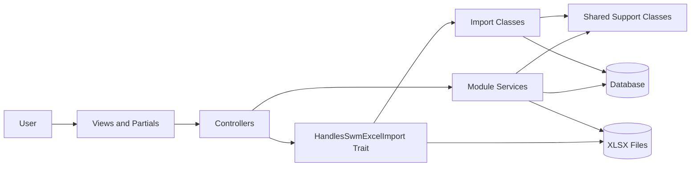
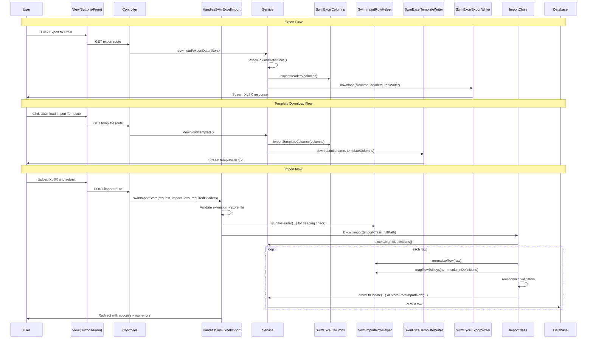

# Import/Export Walkthrough (Top-Level to Function-Level)

This document explains the Excel import/export architecture from the top UI layer down to controllers, services, shared support classes, and concrete import classes.

It focuses on the current implementation pattern used by:
- Household (`building-info/households`)
- Low Income Community (`layer-info/low-income-communities`)
- SWM modules (same shared pattern)

---

## 0) Architecture Diagrams

### 0.1 Top-Level Diagram

### 0.2 Detailed Diagram (Import + Export Sequence)

---

## 1) Top-Level View Layer

### 1.1 List page action buttons
**File:** `resources/views/swm/partials/excel-import-export-header.blade.php`

This partial renders the top buttons:
- Add
- Import from Excel
- Download Import Template
- Export to Excel

It is permission-aware using `@can(...)`.

### 1.2 Import page UI
**File:** `resources/views/swm/partials/import-excel.blade.php`

This is a shared import form view:
- Renders one file input (`import_file`)
- Accepts `.xlsx`
- Posts to a route provided by each controller (`$storeRoute`)
- Uses the shared "Back to List" navigation

This keeps import UX consistent across all modules.

---

## 2) Controller Layer (Routing & Orchestration)

Controllers use a common trait to avoid duplicated import handling code.

### 2.1 Shared trait for import behavior
**File:** `app/Http/Controllers/Swm/Concerns/HandlesSwmExcelImport.php`

#### `swmImportFormView(string $pageTitle, string $backRoute, string $storeRoute)`
- Returns `swm.partials.import-excel` with title and routes.

#### `swmImportStore(Request $request, string $importClass, array $requiredHeaders, string $indexRoute, string $disk, string $filenamePrefix, string $entityName)`
This is the full shared import pipeline:

1. Validates file extension is `.xlsx`.
2. Stores uploaded file on configured disk.
3. Reads heading row with `HeadingRowImport`.
4. Normalizes headers with `SwmImportRowHelper::slugifyHeader(...)`.
5. Validates required headers exist.
6. Instantiates import class (`new $importClass((int) Auth::id())`).
7. Runs `Excel::import(...)`.
8. Redirects with success message and row-level errors if any.

Important detail:
- Required headers are now checked via **slugified labels**, matching template headers better.

### 2.2 Example module controllers

#### Household controller
**File:** `app/Http/Controllers/BuildingInfo/HouseholdController.php`

- `export(Request $request)` -> delegates to service `download(...)`
- `downloadTemplate()` -> delegates to service `downloadTemplate()`
- `importForm()` -> calls `swmImportFormView(...)`
- `importStore(Request $request)` -> calls `swmImportStore(...)` with:
  - `HouseholdImport::class`
  - required headers from `HouseholdService::requiredImportLabels()`

#### Low Income Community controller
**File:** `app/Http/Controllers/LayerInfo/LowIncomeCommunityController.php`

Same pattern:
- `importStore(...)` uses `LowIncomeCommunityImport::class`
- required headers from `LowIncomeCommunityServiceClass::requiredImportLabels()`

---

## 3) Service Layer (Source of Truth for Columns)

Services define:
- export headers/order
- import template headers/order
- required columns
- export value mapping

### 3.1 Household service
**File:** `app/Services/BuildingInfo/HouseholdService.php`

#### `download(array $data): void`
- Builds column definitions from `excelColumnDefinitions()`
- Extracts headers via `SwmExcelColumns::exportHeaders(...)`
- Applies filters
- Streams rows using `SwmExcelExportWriter`
- Generates each row in the same column order using:
  - `SwmExcelColumns::buildExportRow(...)`
  - `formatHouseholdExportValue(...)`

#### `downloadTemplate(): void`
- Generates template via `SwmExcelTemplateWriter`
- Uses `importTemplateColumns()`

#### `requiredImportLabels(): array`
- Returns required labels from column definitions.

#### `importTemplateColumns(): array`
- Converts full definitions into template-ready columns.

#### `excelColumnDefinitions(): array`
- **Main source of truth** for household import/export columns.
- Includes key/label and metadata:
  - `required`
  - `dropdown`
  - import/export flags (when needed)

#### `formatHouseholdExportValue(string $key, Household $row): mixed`
- Maps each key to export value.
- Handles transformations (e.g., Yes/No labels, date formatting, `name - id` labels).

### 3.2 Low Income Community service
**File:** `app/Services/LayerInfo/LowIncomeCommunityServiceClass.php`

#### `exportData($data)`
- Same export flow pattern as Household.
- Uses `excelColumnDefinitions()` + `formatLicExportValue(...)`.

#### `downloadTemplate()`
- Uses `SwmExcelTemplateWriter` and `importTemplateColumns()`.

#### `requiredImportLabels()`
- Returns required import labels from column definitions.

#### `importTemplateColumns()`
- Converts full defs to import template structure.

#### `excelColumnDefinitions()`
- Source of truth for LIC column order and labels.
- `id` is export-only (`import: false`).

#### `formatLicExportValue(string $key, LowIncomeCommunity $lic): mixed`
- Per-column export mapping and value formatting.

#### `storeFromImportRow(array $row, int $userId): void`
- Domain validation and persistence for one import row.
- Enforces required and conditional constraints.
- Throws `InvalidArgumentException` for row-level validation errors.

---

## 4) Shared Support Classes

### 4.1 Column utility
**File:** `app/Support/Swm/SwmExcelColumns.php`

#### `exportHeaders(array $columns): array`
- Returns labels for exportable columns (`export !== false`).

#### `importTemplateColumns(array $columns): array`
- Returns template column config for importable columns (`import !== false`).
- Keeps metadata (`required`, `dropdown`, `multiselect`, `reference_key`).

#### `requiredImportLabels(array $columns): array`
- Returns labels of required import columns.

#### `exportableColumns(array $columns): array`
- Filters only exportable columns.

#### `buildExportRow(array $columns, mixed $model, callable $valueResolver): array`
- Builds row values in exact export column order.
- Calls resolver per key to transform values.

### 4.2 Import row helper
**File:** `app/Support/Swm/SwmImportRowHelper.php`

#### Header/key mapping helpers
- `slugifyHeader(string $header): string`
- `normalizeRow(array $raw): array`
- `mapRowToKeys(array $norm, array $columnDefinitions): array`

`mapRowToKeys` is key for robust imports:
- tries key aliases and label-derived aliases
- maps label-based headers back to canonical keys

#### Parsing helpers
- `rowIsEmpty(...)`
- `parseDate(...)`
- `parseMonth(...)`
- `parseBoolean(...)`
- `parseCommaSeparatedInts(...)`

#### Lookup/enum resolvers
- `resolveByLabel(...)`
- `resolveConfigKey(...)`
- `resolveEnumKey(...)`

### 4.3 Template writer
**File:** `app/Support/Swm/SwmExcelTemplateWriter.php`

#### `download(...)`
- Outputs generated spreadsheet to browser.

#### `buildSpreadsheet(array $columns): Spreadsheet`
- Creates sheets:
  - `Import`
  - `Instructions`
  - `Reference` (hidden)
- Writes headers
- Adds dropdown validations
- Adds multiselect usage instructions

#### `writeInstructionsSheet(...)`
- General import instructions + multiselect guidance.

#### `appendMultiselectInstructions(...)`
- Column-specific multiselect hints.

### 4.4 Export writer
**File:** `app/Support/Swm/SwmExcelExportWriter.php`

#### `download(string $filename, array $headers, callable $writeRows): void`
- Writes header row
- Invokes callback to write data rows
- Streams file to browser

---

## 5) Import Classes (Row Processing)

Each module has an import class implementing:
- `ToCollection`
- `WithHeadingRow`

Common structure:
1. Receive rows from Excel.
2. Normalize/map row with `SwmImportRowHelper`.
3. Skip empty rows.
4. Validate and transform fields.
5. Save through service.
6. Track:
   - `successCount`
   - `errors[]`

### 5.1 Household import
**File:** `app/Imports/BuildingInfo/HouseholdImport.php`

#### `collection(Collection $rows): void`
- Loads service + column definitions
- Maps LIC and worker labels for foreign keys
- Uses:
  - `normalizeRow(...)`
  - `mapRowToKeys(...)`
- Validates required values and references
- Builds data payload
- Persists using `HouseholdService::storeOrUpdate(...)`

#### `resolveStatus($value): ?string`
- Accepts both key values and display labels.

### 5.2 LIC import
**File:** `app/Imports/LayerInfo/LowIncomeCommunityImport.php`

#### `collection(Collection $rows): void`
- Uses `excelColumnDefinitions()` for key/label mapping
- Row mapping via `mapRowToKeys(...)`
- Delegates row business validation/saving to:
  - `LowIncomeCommunityServiceClass::storeFromImportRow(...)`

---

## 6) End-to-End Flow Summary

### Export flow
1. User clicks **Export to Excel**.
2. Controller calls service export method.
3. Service gets `excelColumnDefinitions()`.
4. Headers built from labels.
5. Rows produced using `buildExportRow(...)` + module formatter.
6. `SwmExcelExportWriter` streams `.xlsx`.

### Download template flow
1. User clicks **Download Import Template**.
2. Controller calls service `downloadTemplate()`.
3. Service passes `importTemplateColumns()` to `SwmExcelTemplateWriter`.
4. Writer generates Import + Instructions + hidden Reference sheet.

### Import flow
1. User opens import form and uploads `.xlsx`.
2. Controller trait validates extension + required headers.
3. Trait runs module import class.
4. Import class maps headers->keys and validates row content.
5. Service persists row data.
6. Success and per-row errors returned to UI.

---

## 7) Design Rules in Current Code

1. **Service column definitions are the single source of truth** for order/labels.
2. **Template and export must align** with form labels/order as much as possible.
3. **Header matching is label-friendly** through slug+mapping.
4. **Row-level errors are non-blocking**: one bad row does not stop whole import.
5. **Shared infrastructure, module-specific validation**:
   - shared trait/helpers/writers for plumbing
   - service/import class for domain rules

