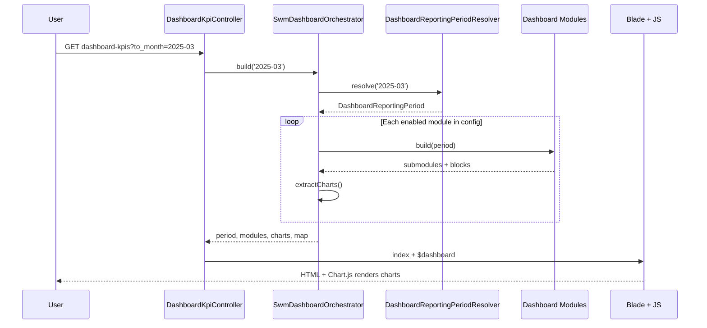

# SWM Dashboard — Simple Step-by-Step Walkthrough

This guide explains how the **Solid Waste Management (SWM) Dashboard** is built, starting from `SwmDashboardOrchestrator`. It uses plain language and follows the real call order in the app.

---

## The big picture

Think of the dashboard as a **factory assembly line**:

1. A user opens the page (or changes the month filter).
2. A **controller** asks the **orchestrator** to build everything.
3. The orchestrator picks a **reporting period** (which month “through” we’re showing).
4. It runs each **enabled module** (Households, Billing, Complaints, etc.).
5. Each module queries the database and returns structured **tiles, tables, and charts**.
6. The orchestrator bundles that into one `$dashboard` array.
7. **Blade views** render the HTML; **JavaScript** draws the charts from the bundled chart list.

The orchestrator does **not** run SQL itself. It only coordinates modules and collects their output.

---

## Step 0 — How the user gets here

| What | Where |
|------|--------|
| Page URL | `GET /swm/dashboard-kpis` (name: `swm.dashboard-kpis.index`) |
| JSON API (same data) | `GET /swm/dashboard-kpis/data` |
| Partial HTML refresh | `GET /swm/dashboard-kpis/modules` |
| Ward map shapes | `GET /swm/dashboard-kpis/ward-geometries` |

**Controller:** `app/Http/Controllers/Swm/DashboardKpiController.php`

- Requires login (`auth` middleware).
- Requires permission **“List SW Dashboard and KPIs”** for index/data/modules/map.
- Reads optional query param: `to_month` (format `YYYY-MM`, e.g. `2025-03`).
- Calls `$this->orchestrator->build($request->input('to_month'))`.
- Returns either the full page view or JSON.

```php
// Simplified — what the controller does
$dashboard = $this->orchestrator->build($request->input('to_month'));
return view('swm.dashboard.index', compact('page_title', 'dashboard'));
```

---

## Step 1 — `SwmDashboardOrchestrator::build()`

**File:** `app/Services/Swm/Dashboard/SwmDashboardOrchestrator.php`

This is the **single entry point** for dashboard data. Everything below happens inside `build()`.

### 1a. Resolve the reporting period

```php
$period = $this->periodResolver->resolve($toMonthInput);
```

**`DashboardReportingPeriodResolver`** turns the user’s month (or a default) into a `DashboardReportingPeriod` object:

- **`toMonth`** — which calendar month we report “through” (start of that month).
- **`periodEnd`** — last moment of that month (end of day).
- **`windows`** — how many days of history to use for different data sources:
  - **Household** data: from earliest household `created_at` → `periodEnd`
  - **Landfill** data: from earliest landfill log → `periodEnd`
  - **Complaint** data: from earliest complaint → `periodEnd`

**Rules you should know:**

- If `to_month` is missing or invalid, it uses `config('swm_dashboard.default_to_month')`, or else **last complete month** (not the current month).
- You cannot pick a month **after** “last month” — the resolver **clamps** future dates down.

Modules use `$period` when they need date-bounded queries (e.g. cumulative charts, landfill averages).

### 1b. Prepare empty buckets

```php
$modules = [];
$moduleViews = [];
$charts = [];
```

These will be filled as each module runs.

### 1c. Loop over configured modules

```php
foreach (config('swm_dashboard.modules', []) as $key => $config) {
```

**Config file:** `config/swm_dashboard.php`

Each module entry looks like:

```php
'households' => [
    'class' => HouseholdDashboardModule::class,
    'view'  => 'swm.dashboard.modules.households',
    'enabled' => true,
    'permission' => null,  // optional; can also live on the module class
],
```

For **each** module, the orchestrator applies filters in order:

| Check | If it fails… |
|--------|----------------|
| `enabled` is not true | Skip module |
| `class` missing or class does not exist | Skip module |
| Class does not implement `SwmDashboardModuleInterface` | Skip module |
| User fails `userCanViewModule()` | Skip module |

**Permission check** (`userCanViewModule`):

- Calls `$module->permission()`.
- If that returns `null`, everyone who can open the dashboard sees the module.
- If it returns a permission name, Laravel’s `$user->can($permission)` must be true.

### 1d. Build the module

```php
$module = app($class);           // Laravel creates the module (with its dependencies)
$payload = $module->build($period);
```

Each module is responsible for:

- Running its own database queries / services.
- Formatting numbers via `SwmDashboardFormatter` where needed.
- Returning a **standard shape** (see Step 2).

The orchestrator then stores:

```php
$modules[$key] = array_merge($payload, ['label' => $module->label()]);
$moduleViews[$key] = $config['view'] ?? null;
$charts = array_merge($charts, $this->extractCharts($payload));
```

- **`modules`** — data + human-readable section title (`label`).
- **`moduleViews`** — which Blade file to `@include` for that section.
- **`charts`** — flat list of every chart definition found in the payload (for front-end Chart.js).

### 1e. Extract charts from module payload

`extractCharts()` walks:

```
module → submodules[] → blocks[] → (only type === 'charts') → items[]
```

Any chart `item` with an `id` is pushed into the top-level `charts` array. The browser script uses those IDs to find `<canvas>` elements and render Chart.js graphs.

### 1f. Add map settings

```php
'map' => $this->mapConfig(),
```

This is **not** ward statistics — it’s configuration for map widgets:

- GeoServer URL, workspace, auth key
- City bounding box (from `MapsService`)
- URL to load ward geometries as GeoJSON (`ward-geometries` route)

### 1g. Return the full dashboard array

```php
return [
    'period'       => [ /* month, end date, max month, day counts per source */ ],
    'modules'      => [ /* keyed module payloads + labels */ ],
    'moduleViews'  => [ /* blade view name per module */ ],
    'charts'       => [ /* flat chart configs for JS */ ],
    'map'          => [ /* geoserver + bbox + ward layer */ ],
];
```

That array is what the controller passes to views as `$dashboard`.

---

## Step 2 — What a module must implement

**Interface:** `app/Services/Swm/Dashboard/Contracts/SwmDashboardModuleInterface.php`

| Method | Purpose |
|--------|---------|
| `key()` | Stable id, e.g. `'households'` |
| `label()` | Section title shown on the page |
| `build($period)` | Returns all KPI/chart data for that section |
| `permission()` | Optional gate; `null` = no extra gate |

### Shape returned by `build()`

```text
[
  'submodules' => [
    [
      'key'    => 'municipality',
      'title'  => 'Municipality Overview',
      'blocks' => [
        [ 'type' => 'tiles',  'items' => [ /* KPI cards */ ] ],
        [ 'type' => 'charts', 'items' => [ /* chart definitions with id */ ] ],
        [ 'type' => 'table',  ... ],
        // other block types as needed
      ],
    ],
    // more submodules...
  ],
]
```

**Example module:** `HouseholdDashboardModule`  
- Submodules: Municipality Overview, Waste Generation & Collection, LIC, etc.  
- Queries `building_info.households`, landfill logs, complaints, etc.  
- Builds bar/doughnut chart configs with stable DOM ids like `swmChartHouseholdsByWard`.

Other modules follow the same pattern:

| Config key | Class | Blade view |
|------------|-------|------------|
| `households` | `HouseholdDashboardModule` | `modules/households` |
| `service_providers` | `ServiceProvidersDashboardModule` | `modules/service-providers` |
| `service_facilities` | `ServiceFacilitiesDashboardModule` | `modules/service-facilities` |
| `service_management` | `ServiceManagementDashboardModule` | `modules/service-management` |
| `billing` | `BillingDashboardModule` | `modules/billing` |
| `complaints` | `ComplaintsDashboardModule` | `modules/complaints` |

To **add** a new dashboard section later: create a class implementing the interface, register it in `config/swm_dashboard.php`, and add a Blade module view — the orchestrator loop does not need to change.

---

## Step 3 — How the page uses `$dashboard`

**Main view:** `resources/views/swm/dashboard/index.blade.php`

1. **Month filter** — form field `to_month`, max = `period.max_to_month`, value = `period.to_month`.
2. **Modules loop** — for each entry in `$dashboard['modules']`, includes the matching view from `$dashboard['moduleViews']`:

   ```blade
   @include($viewName, ['module' => $modulePayload])
   ```

3. **Scripts** — passes `period`, `charts`, chart colors, and API URLs into `swm-dashboard.js` so charts can be drawn and the page can refresh without a full reload (via `data` / `modules` routes).

**Rendering building blocks** (shared components):

- `components/metrics-body.blade.php` — walks submodules/blocks
- `components/tile.blade.php` — KPI number cards
- `components/chart-card.blade.php` — canvas placeholders for charts
- `components/metric-table.blade.php` — tabular metrics

Module-specific blades (e.g. `modules/households.blade.php`) mostly wrap `metrics-body` in a collapsible section banner.

---

## End-to-end flow (diagram)



---

## Quick reference — orchestrator responsibilities only

| Does | Does not |
|------|----------|
| Pick reporting month and windows | Query households, billing, etc. |
| Read module list from config | Know business formulas |
| Enforce module interface + permissions | Render HTML (views do that) |
| Merge chart configs for JS | Load ward GeoJSON (separate endpoint) |
| Attach map connection settings | |

---

## Related files (for deeper reading)

| File | Role |
|------|------|
| `SwmDashboardOrchestrator.php` | Coordinator — start here |
| `DashboardReportingPeriodResolver.php` | Month parsing and date windows |
| `DashboardReportingPeriod.php` | Period value object passed to modules |
| `config/swm_dashboard.php` | Which modules are on and their views |
| `DashboardKpiController.php` | HTTP entry |
| `documentations/code_documents/20 - swm-dashboard-data-flow.md` | More technical / diagram-heavy reference |

---

## One-sentence summary

**The orchestrator resolves “through which month” we report, runs every enabled and permitted dashboard module to collect KPIs and chart configs, flattens charts for JavaScript, adds map settings, and hands one `$dashboard` array to the controller and views.**
